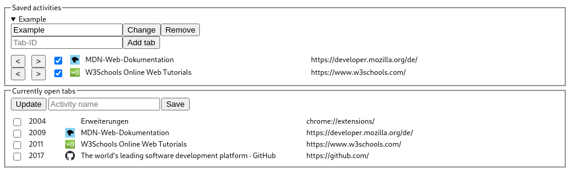
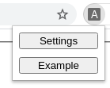

# Chrome Activity Manager

## Description

This is a simple chrome extension that allows you to manage activities by saving tabs in groups.

## Install

Follow the instructions to load this unpacked extension: https://developer.chrome.com/extensions/getstarted#manifest

## Usage

Groups can be deleted, renamed and replaced.

Tabs can be removed from a group and their order can be changed. New tabs can be added by their tab id (second field under `Currently open tabs`).

You can manage your activities by clicking the `Settings` button in the extension popup.

Saved activities can be started by clicking their button in the popup menu.

Modifiers:
- Shift: open the tabs in a new window
- Control: open the tabs but don't change the focus
